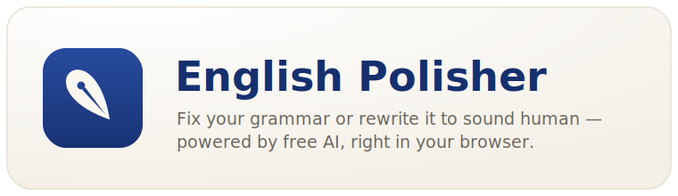
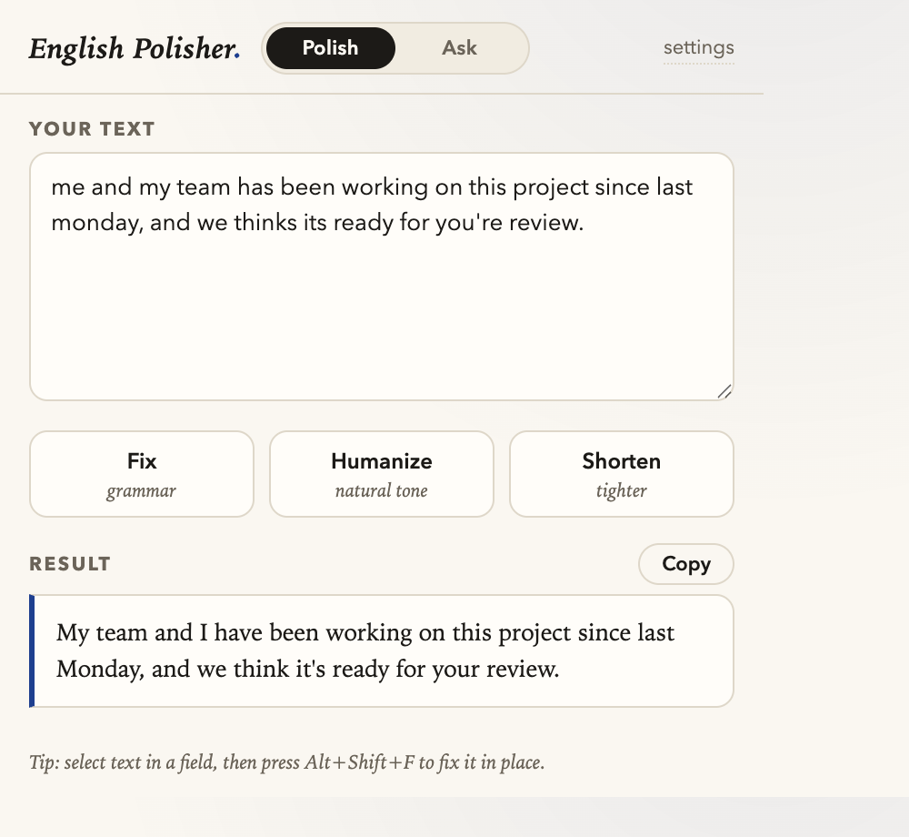
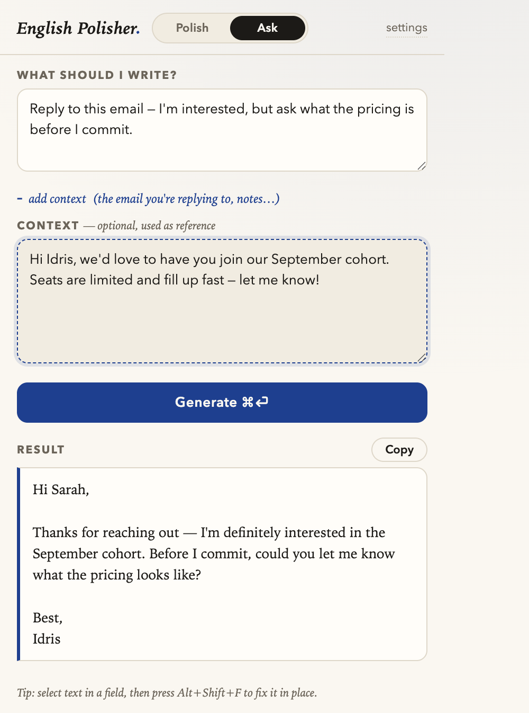

<div align="center">



<br/>

**Fix your grammar or rewrite anything to sound genuinely human — powered by free AI, right in your browser.**

[](LICENSE)


</div>

---

English Polisher is a lightweight Chrome extension that cleans up your writing or drafts it for you. Paste text and **Polish** it (fix grammar, humanize the tone, or shorten it), or switch to **Ask** and give an instruction like *"reply to this email"* with the original email as context. It runs on the free tier of Google Gemini out of the box, works fully offline with Chrome's built-in on-device AI, and also supports Groq, OpenRouter, and Anthropic Claude.

No account, no server, no build step — load it unpacked and add a free API key.

## Highlights

- ✍️ **Polish mode** — one click to **Fix** grammar & spelling, **Humanize** stiff/robotic text, or **Shorten** it.
- 💬 **Ask mode** — free-form instructions ("reply to this email politely declining", "write a short bio") with optional context you paste in.
- 🖊️ **In-field button** — a small nib appears in the corner of any text box on the web; click it for Fix / Humanize / Shorten and the field is rewritten in place, with a loading state.
- 🆓 **Free by default** — Google Gemini's free tier needs no credit card; Chrome's built-in AI needs no key at all.
- 🔌 **Five providers** — Gemini, Chrome built-in AI (Gemini Nano), Groq, OpenRouter, and Anthropic Claude. Switch anytime in settings.
- ⌨️ **In-place editing** — select text in any editable field and press a shortcut to replace it (with undo).
- 🔒 **Private** — your keys live in `chrome.storage.sync`; text goes only to the provider you choose (nowhere at all with the on-device model).

## Screenshots

<div align="center">

&nbsp;&nbsp;

</div>

<div align="center"><sub><b>Polish</b> — clean up your text &nbsp;·&nbsp; <b>Ask</b> — draft a reply from context</sub></div>

## Install

The extension is distributed as an unpacked extension (no build required).

1. Download or clone this repository.
2. Open `chrome://extensions` in Chrome.
3. Enable **Developer mode** (top-right toggle).
4. Click **Load unpacked** and select this folder.
5. Click the English Polisher toolbar icon → **settings**, pick a provider, and paste a key.

## Choose an AI provider

Open **settings** and pick one. Gemini is the recommended default.

| Provider | Cost | Get a key | Notes |
|---|---|---|---|
| **Google Gemini** ⭐ | Free tier | [aistudio.google.com/apikey](https://aistudio.google.com/apikey) — no card | ~10–15 requests/min, ~1,500/day — plenty for personal use |
| **Chrome built-in AI** (Gemini Nano) | 100% free, on-device | No key needed | Recent Chrome + ~16 GB RAM; downloads a ~4 GB model on first use; text never leaves your machine |
| **Groq** | Free tier | [console.groq.com/keys](https://console.groq.com/keys) | Very fast Llama models |
| **OpenRouter** | Free models | [openrouter.ai/keys](https://openrouter.ai/keys) | Use any model ending in `:free` |
| **Anthropic Claude** | Paid (no free tier) | [console.anthropic.com](https://console.anthropic.com) | Best quality; Claude Haiku costs a fraction of a cent per rewrite |

> If a default model name ever stops working, just change it in settings — for example `gemini-flash-latest` tracks Google's current Flash model.

## Usage

### Popup

Click the toolbar icon. Toggle between the two modes with the pill beside the title:

- **Polish** — paste text into *Your text*, then hit **Fix**, **Humanize**, or **Shorten**.
- **Ask** — type an instruction, optionally expand **add context** to paste the email/notes to work from, then **Generate**. Press `⌘/Ctrl + Enter` to submit.

Every result has a **Copy** button.

### In-field button

Click into any text box on a web page (textarea, comment box, rich editor, or a
reasonably wide text input) and a small nib button appears in its bottom-right
corner. Click it to open **Fix / Humanize / Shorten**; the field (or your current
selection within it) is rewritten in place, with the button spinning and the field
gently highlighted while it works. Undo with `⌘/Ctrl + Z`.

It also works inside **embedded frames** (iframes) and **shadow-DOM editors** such
as Reddit's comment and chat composers. It can't appear in editors that render
their own canvas (e.g. Google Docs) or that use a closed shadow root.

Prefer it off? Turn it off in **settings → In-page**.

### Keyboard shortcuts (edit in place on the page)

Select text inside any editable field (Gmail, textareas, comment boxes) and press:

| Shortcut | Action |
|---|---|
| `Alt + Shift + F` | Fix grammar & spelling |
| `Alt + Shift + H` | Humanize the tone |

The selection is replaced in place — `⌘/Ctrl + Z` undoes it. On read-only text, a small panel shows the result with a Copy button instead. Rebind the shortcuts at `chrome://extensions/shortcuts`.

### Custom style (optional)

In settings you can add standing instructions applied to every rewrite, e.g. *"Keep British spelling. Never use exclamation marks."*

## Privacy

- **API keys** are stored in `chrome.storage.sync` (synced to your Chrome profile) and sent only to the provider you select.
- **Your text** is sent only to the provider you configure — except **Chrome built-in AI**, which runs entirely on your device and sends nothing.
- The extension has no analytics and no backend of its own.

See the full [privacy policy](PRIVACY.md).

## Project structure

```
english-polisher/
├── manifest.json      # MV3 manifest (storage, activeTab, scripting; keyboard commands)
├── background.js      # service worker: keyboard commands + all provider API calls
├── content.js         # selection capture, in-place replacement, read-only result panel
├── popup.html/js      # the toolbar popup (Polish / Ask)
├── options.html/js    # provider, API key, and style settings
├── icons/             # toolbar icons (16 / 48 / 128)
└── assets/            # logo + screenshots (used by this README)
```

## Development

There is no build step — it's plain HTML/CSS/JS loaded directly by Chrome.

1. Edit the files.
2. Go to `chrome://extensions` and click **↻ Reload** on English Polisher.
3. For content-script changes (keyboard shortcuts), also refresh any open tabs.

Adding a provider is a matter of adding a `case` to `rewrite()` in `background.js` and a settings block in `options.html`.

## Publishing to the Chrome Web Store

The repo is submission-ready:

- Run `./build-zip.sh` to produce `english-polisher-<version>.zip` (only the files Chrome runs).
- [`STORE_LISTING.md`](STORE_LISTING.md) has the ready-to-paste listing copy, permission justifications, and data-usage answers.
- [`PRIVACY.md`](PRIVACY.md) is the privacy policy the store requires.
- `store/` contains the 1280×800 screenshots and a 440×280 promo tile.

Publishing itself needs a [Chrome Web Store developer account](https://chrome.google.com/webstore/devconsole) (one-time $5 fee): upload the ZIP, paste the listing, attach the screenshots, and submit for review.

## License

[MIT](LICENSE) © 2026 Idris Syed
